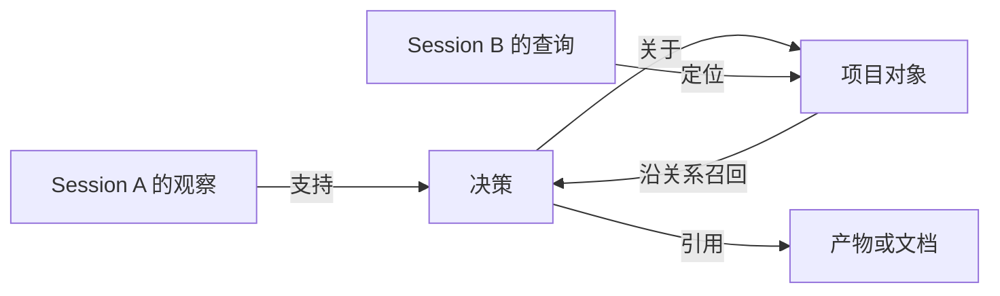

# mmdb Feature Doc：面向 Agent 的上下文 Ontology

状态：产品基线 v1.0，核心方向已对齐，2026-09-08。

mmdb 是借鉴 Palantir Ontology 的、面向 agent 的上下文管理组件。它支持应用自定义对象和关系类型，将值得保留的信息组织为可持久化、可关联、可查询的对象，为不同 agent harness 提供上下文召回能力。

本文记录本轮逐项确认的产品目标。已确认的方向列在下节；其余标为建议的对象划分、接口细节和验收条件供后续技术设计验证，具体 schema、API 和实现尚未冻结。

应用侧行为见 [miumiu Feature Doc：Graph Context 与 Dynamic Workflow](../../miumiu/docs/FEATURES.md)。

实施方案与阶段进度：[mmdb 上下文内核](CONTEXT-DESIGN.md)。独立 Rust harness 接口、业务动作及检查点已接通 S1 至 S4 的应用路径；2026-09-09 首轮真实模型任务及独立原生核对见 [MiuMiu 质量验收](../../miumiu/docs/CONTEXT-ACCEPTANCE.md)。

## 已对齐的决定

截至 2026-09-08，已确认以下产品方向：

- mmdb 允许应用定义自己的对象和关系类型，以支持不同领域的 agent。
- 未来的 agent 包括 research、trading、pmo 等，它们都可以运行在 miumiu 上。
- mmdb 面向所有 harness 提供统一的 ontology 与上下文接入契约，覆盖类型定义、内容写入、关系查询与召回、历史读取和业务动作描述，独立于 miumiu 的运行时和领域模型。
- mmdb 统一管理对象身份、版本、作用域和引用，封装底层存储与召回实现；harness 负责任务规划、工具执行、权限控制和模型窗口管理。具体接入方式另行设计。
- agent 可以在运行中自主新增对象类型和关系类型，优先复用已有定义，仅在现有类型无法表达领域概念时扩展。
- mmdb 负责类型校验、冲突识别和版本记录。
- 同一用户下，持久上下文默认可跨 agent、跨 session 召回，按当前任务、项目和相关对象筛选；每个运行的执行状态分别管理。
- agent 身份和 session 身份保留为来源信息。
- 执行任务的 agent 自主选择并保存会影响后续判断、行动或任务恢复的上下文，写入后即可参与召回；每条信息保留来源，模型推断明确标记为推断，支持后续修正。
- 用户与 assistant 的对话、工具调用及结果默认完整保存在 mmdb，作为可搜索、可按引用展开的原始历史；agent 整理的必要上下文用于日常召回。
- miumiu 的 dynamic workflow 根据目标和召回上下文规划，并支持新证据、执行失败或用户约束变化触发的自主重规划；计划版本、调整原因和已完成结果由 harness 管理。
- mmdb 支持业务动作建模，描述动作涉及的对象、输入、前置条件并保存执行记录；harness 管理工具绑定、权限和实际执行。
- 模型窗口切换时 session 保持不变；同一 session 的原始对话、工具调用及结果保存在一条连续、有序的历史链上。mmdb 保存检查点及历史位置、关键记录引用，harness 据此恢复当前任务。
- miumiu 的 workflow 模板提供初始计划，单次运行可以自主调整；经过验证的改进可另存为模板新版本，供后续任务选择复用。模板版本与运行计划由 harness 分别管理。

默认的 agent 上下文模型仍作为建议起点。类型变更的兼容性、冲突判定和存量数据处理留给技术设计。

## Ontology 借鉴什么

Palantir 的核心概念包括对象类型、属性、关系类型和动作类型，用于表达业务对象、对象之间的联系以及可执行的修改。参见 [Palantir Ontology Core Concepts](https://www.palantir.com/docs/foundry/ontology/core-concepts)。

mmdb 的建议映射如下。这里描述产品语义，具体名称不直接等于新增的数据类型。

| 概念 | 在 agent 上下文中的用途 | 候选例子 |
| --- | --- | --- |
| 对象与类型 | 给需要持续引用的信息稳定身份 | 项目、任务、实体、决策、观察、文档或产物 |
| 属性 | 描述内容、来源和适用条件 | 内容、状态、来源 agent 与 session、用户归属及适用范围、记录时间、有效时间 |
| 关系 | 表达信息之间可解释的联系 | 关于某对象、支持某结论、引用某材料、修订某决策 |
| 动作 | 描述对象相关的业务操作、输入与前置条件，关联执行记录 | 更新里程碑，以及新增证据、修正结论等上下文操作 |

O-Q1b 已于 2026-09-08 确认：mmdb 负责业务动作建模，harness 负责执行。mmdb 描述动作的作用对象、输入、前置条件及执行记录，供 agent 理解和查询；具体工具绑定、权限判断和实际执行由 harness 管理。

例如 pmo 的「更新里程碑」，mmdb 关联里程碑、动作定义和执行结果，miumiu 调用实际项目工具完成更新。agent 可以据此按对象找到相关动作，并回查动作的执行记录。

动作是否能在当前运行中执行，由 harness 的实际工具绑定与权限决定。mmdb 保存动作语义和执行记录，harness 产生实际执行结果并写回相应来源与记录。

## 要提供的核心能力

以下能力将已确认的方向展开为目标行为，查询字段、状态语义及边界处理仍需技术设计细化。

| 编号 | 能力 | 预期行为 |
| --- | --- | --- |
| O-01 | 保存有来源的上下文 | 接受 agent 自主选择的上下文，校验并持久保存后即可参与召回；记录保留来源、观察或推断的身份，并支持修正 |
| O-02 | 组织对象及关系 | 同一对象可被不同 session 引用；关系有明确含义，能查询其端点及依据 |
| O-03 | 按需召回 | 按查询、对象、范围和时间等条件取回相关内容；返回可继续展开的记录引用 |
| O-04 | 用关系补充召回 | 从直接命中的对象或记录出发，按有界关系路径寻找相关上下文 |
| O-05 | 跨 agent、跨 session 共享 | 同一用户下的持久上下文默认可共享召回，保留来源 agent 和 session，支持按任务、项目和对象筛选 |
| O-06 | 维护当前与历史状态 | 支持修正、替代、撤回和失效；更新后仍能辨认历史来源 |
| O-07 | 自主扩展领域模型 | 应用可以定义领域对象与关系，agent 也可在运行中自主新增类型；优先复用已有定义，由 mmdb 校验、识别冲突并记录版本 |
| O-08 | 统一接入不同 harness | miumiu 与其他 harness 使用同一套建模、写入、关系查询与召回、历史读取和动作描述语义；对象身份、版本、作用域及引用由 mmdb 统一管理，接入不依赖 miumiu 的运行时 |
| O-09 | 保存与读取连续原始历史 | 同一 session 的所有模型窗口共用一条有序历史链，完整持久保存对话、工具调用及结果；保留稳定引用、来源和调用关联，支持搜索、展开及检查点定位 |
| O-10 | 建模业务动作 | 描述动作的作用对象、输入和前置条件，支持按对象发现动作并查询执行记录；由 harness 绑定工具、管理权限并执行 |

这些能力服务于「保存后能找到、找到后能理解、需要时能核对」。文本、向量、图和 blob 是实现手段；具体召回算法与是否需要 embedding，留给技术设计决定。

## 面向 harness 的统一接入契约

O-Q2 已于 2026-09-08 确认：mmdb 对所有 harness 提供统一的 ontology 与上下文能力，并负责对象身份、版本、作用域和引用的一致语义。

| 统一能力 | 对外语义 |
| --- | --- |
| 类型定义 | 发现、复用及新增对象与关系类型，由 mmdb 校验、识别冲突并记录版本 |
| 内容写入 | 保存带来源的内容、对象及关系，返回可持续引用的记录；管理版本、作用域及修订关系 |
| 关系查询与召回 | 按需求和允许范围查找对象及相关上下文，返回来源和可展开的记录引用 |
| 历史读取 | 搜索完整原始历史，按稳定引用读取记录或历史版本，并定位检查点关联的历史位置 |
| 业务动作描述 | 根据对象发现动作，读取输入、前置条件及执行记录；接收 harness 写回的实际结果 |

harness 提供任务需求和调用范围，负责任务规划、工具执行、权限控制及模型窗口管理。mmdb 在允许范围内处理数据、保持记录一致性，并封装底层存储及召回实现。不同 harness 接入后使用同一套语义，范围内的既有对象和历史记录通过 mmdb 的身份及引用继续定位。

统一契约确定对外的产品边界。函数签名、传输方式、部署形态，以及现有存储入口的整合方式留给技术设计。

## 运行时自主建模

agent 可以在执行任务时发现现有模型尚未覆盖的概念，并新增相应的对象类型或关系类型。例如 research 在任务中建立「实验复现」类型，随后用该类型保存具体复现记录。这同时涉及类型定义及其实例的管理。

已有定义应优先被发现和复用，mmdb 在接受新定义时执行校验和冲突检查，并保留可追溯的版本。具体的类型命名、兼容性及查询接口另行设计；当前已确认的是 agent 在运行时自主建模的能力。

## 上下文的组织方式

原始历史的完整保留与必要上下文的自主整理已确认。下表按使用方式区分原始材料、语义记录和当前召回结果，具体 schema 留给技术设计：

| 层次 | 保存什么 | 使用方式 |
| --- | --- | --- |
| 原始历史与材料 | 完整的用户与 assistant 对话、工具调用及结果，以及已捕获的外部资料 | 搜索历史、按引用核对原文，作为结论和关系的依据 |
| 语义记录 | 对象、结论、决策、任务进展及关联关系，保留来源与推断标记 | 帮助 agent 定位、理解和复用上下文 |
| 召回结果 | 当前查询选中的记录、版本、来源和关联路径 | 交给 harness 组装本轮工作上下文 |

原始对话、工具调用及结果默认完整持久化在 mmdb，支持搜索和按引用读取。agent 未选择整理的信息仍保留在原始历史中；后续可以回查，再补充为 ontology 中的对象、结论或关系。具体应用行为见 [miumiu 的原始历史保留策略](../../miumiu/docs/FEATURES.md#原始历史保留)。

来源引用必须能定位对应原文。外部资料可以使用已捕获内容或可靠来源引用；若来源已不可用，结果应明确表达。摘录保留原文引用，mmdb 的记录身份独立于摘要内容。

模型窗口切换保持原 session 身份，后续交互继续追加到该 session 的历史链。mmdb 保留既有消息的身份、顺序及工具调用与结果的关联；检查点通过历史位置和关键记录引用提供恢复入口。恢复过程读取既有记录，新窗口继续产生的交互再追加到原链。

同一 session 的历史在逻辑上连续，跨 session 召回保留各自的历史归属和来源引用。窗口切换与任务恢复由 harness 管理，具体行为见 [miumiu 的窗口切换与会话连续性](../../miumiu/docs/FEATURES.md#窗口切换与会话连续性)。

图中 Session B 可以通过项目对象找到既有决策，再展开支撑它的观察和材料。不同 session 的引用最终指向可识别的同一对象，这是 graph context 要验证的行为。

## 召回与 harness 的分工

已确认由 harness 提供当前需求与范围，mmdb 返回带依据的候选上下文。下表是接口字段的建议输入，具体结构留给技术设计。

| 方向 | 所需信息 |
| --- | --- |
| 查询输入 | 当前问题或目标、已知对象或记录引用、允许的作用域、必要的时间条件、结果与关系扩展上限 |
| 召回输出 | 记录身份及版本、可用内容或摘录、来源引用、状态及有效时间、命中依据；经关系扩展的结果附关联路径 |
| 历史搜索与后续读取 | 搜索原始对话、工具调用及结果，根据稳定引用展开原文、检查对象关系，或读取指定历史版本 |

接入的 harness 决定何时查询、取用哪些候选，以及如何满足模型的 token 预算；在 miumiu 中由 miumiu 承担这些职责。mmdb 负责查询范围、记录一致性和结果来源；不能把不属于允许范围的内容带入关系扩展结果。

日常召回优先使用 agent 整理的必要上下文；原始历史提供来源展开和遗漏信息回查。harness 可以据此补充 ontology，并保留新记录与原始历史之间的引用。

关系召回需要控制扩展范围，并避免循环和重复结果。如果没有相关内容、关系依据不足或记录已失效，应能区分这些情况。向量相似度可以帮助找到候选，但不能自动成为「两个记录之间存在事实关系」的依据。

最小实现可以先使用稳定引用、词项检索、范围过滤和显式关系扩展。只有它无法覆盖目标场景时，再评估向量召回、模型重排等增强能力。

## 共享与更新语义

跨 agent、跨 session 共享是同一用户下的多个 agent 和 session 可以默认引用持久上下文。harness 将用户范围及查询条件传给 mmdb，mmdb 在该范围内按当前任务、项目和相关对象召回，并保留结果的来源身份。

用户归属决定默认共享边界；项目、任务和对象参与相关性筛选，agent 与 session 标明来源。session 结束后，持久上下文继续存在。来源身份不会自动把同一用户的上下文隔离到某个 agent 或 session 内。具体策略见 [miumiu 已确认的默认共享边界](../../miumiu/docs/FEATURES.md#默认共享边界)。

运行状态仍由 harness 分别管理。mmdb 可以存储这些状态，但它们与供其他任务复用的观察、结论及来源记录具有不同用途，查询接口需要保持这种区分。

miumiu 已确认支持执行中的自主重规划，见[动态工作流目标](../../miumiu/docs/FEATURES.md#dynamic-workflow-的含义)。mmdb 提供规划所需的上下文，并保存 agent 从执行结果中选出的必要信息及来源；harness 管理具体计划版本、调整原因和已执行动作，保持上下文复用与运行状态管理的分工。

模板版本与运行计划也由 harness 分别管理，具体见 [miumiu 的模板与运行计划](../../miumiu/docs/FEATURES.md#模板与运行计划)。mmdb 可保存相关经验、验证结果及来源引用，支持后续任务理解和选择可复用的模板。

保存和更新还需要遵守以下语义：

- 原始观察与由模型推断出的结论分别记录并保留来源。推断在保存和召回后仍明确标记为推断；观察证明「当时记录了什么」，不自动证明内容真实。
- 修正、替代和撤回保留版本关系；默认召回应能辨认当前有效信息。
- 并发更新检查版本冲突，避免后写入的旧结论无提示地覆盖新结论。
- 归档或删除导致来源不可用时，引用与派生内容应反映相应状态。
- 召回材料作为参考数据交给 agent，其内容本身不获得执行指令或授权的地位。

自主保存和写入后可召回已确认，具体见 [miumiu 的自主保存策略](../../miumiu/docs/FEATURES.md#自主保存策略)。mmdb 对写入进行结构、来源和版本校验；成功持久化的上下文按默认共享边界进入可召回范围，推断标记随记录和召回结果保留。

## 与现有实现的关系

`native_memory::MemoryDatabase` 提供统一的 `mmdb::context` 契约，复用原生写锁、事务、版本、操作回执和租约。上下文模块实现领域类型、对象与关系、词项及关系召回、完整有序历史、不可变检查点和业务动作描述与执行记录。独立 harness 无需启动 miumiu 即可使用。

多模型 `Database` 仍提供独立的数据能力；其向量召回不自动成为上下文契约的算法。旧原生提案 API 继续使用显式裁决，新的 assistant 上下文写入经结构、来源与版本校验后即可召回。两个路径的权威身份均由可信调用方提供。

当前实现及最终验证边界见[技术方案](CONTEXT-DESIGN.md)。旧数据不迁移，普通 open 不隐式转换或清空目录。

## 建议的验收条件

| 场景 | 通过条件 |
| --- | --- |
| 持久保存 | 关闭并重新打开存储后，必要内容、关系和来源仍可读取 |
| 自主写入后可召回 | agent 选定的上下文经校验并成功保存后，相关查询可直接召回；推断标记和来源不丢失，后续可以修正 |
| 来源展开 | 从一个被召回的结论可以定位支撑它的原始材料或明确的不可用状态 |
| 完整历史与遗漏回查 | 一条未被 agent 整理为必要上下文的原始对话或工具记录，在存储重新打开后仍能被搜索、按引用完整读取，并作为补充 ontology 的来源 |
| 单条历史链与检查点恢复 | 同一 session 多次切换模型窗口后，既有历史引用仍有效，消息按原顺序保留，新交互追加在原链上；检查点能定位相应历史位置，恢复过程不重复保存既有消息 |
| 关系召回 | 一个查询可从直接命中的对象找到间接相关记录，并返回可核对的关联路径 |
| 跨 agent、跨 session 读取 | 同一用户的 trading 在 Session B 可召回 research 在 Session A 保存的相关记录，来源 agent 和 session 不丢失 |
| 范围隔离 | 默认共享保持在当前用户范围内；不在查询允许范围内的记录不会经直接召回或关系扩展进入结果 |
| 修订与冲突 | 新旧结论可辨认；过期版本更新被拒绝或显式报告冲突 |
| 领域类型扩展 | 不同应用可定义各自的对象和关系类型，并通过 mmdb 保存、关联与召回实例 |
| 运行时自主建模 | agent 能在任务执行期间新增对象类型和关系类型，并据此保存实例；同一适用范围内的后续任务可发现并复用定义，类型冲突得到明确反馈 |
| harness 统一且独立接入 | 一个独立于 miumiu 的最小 harness 可通过统一契约完成类型定义、内容写入、关系查询与召回、历史读取和动作描述查询，无需启动 miumiu；在相同允许范围内，对象身份、版本、作用域及引用语义保持一致 |
| 业务动作建模 | agent 可从对象找到相关动作及输入、前置条件；harness 实际执行后，mmdb 中可以查询到关联对象的动作记录及结果 |

最脆弱的假设是：建立和维护的关系能够帮助找到任务真正需要的信息。如果实体归一或关系提取不可靠，图会增加噪声。首轮建议用少量有来源的显式关系验证场景，再决定自动抽取的范围。

## 后续技术设计

S1 至 S4 的统一接口已实现。首轮真实任务已验证模型创建类型、对象、关系和动作后的独立读取，并在副本上验证当前版本、作用域、预算及清除传播。后续扩充任务样本，评估类型和关系的适用性、召回相关性及容量开销，再决定原文索引、向量召回和自动关系抽取的范围。确定性契约测试及单次真实样本都不构成领域推理质量或 token 节省的保证。

已实现能力与验证结果以 [S1 至 S4 实现说明](CONTEXT-DESIGN.md) 为准。
